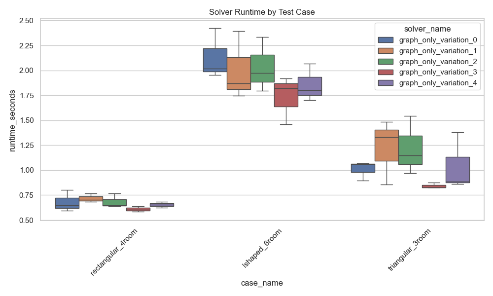

# Benchmark Results Summary

## Overview
This report summarizes the performance evaluation of the Vastu AI solver implementations across different test cases and parameter configurations. The benchmarks were run on various room layouts to assess solver efficiency and solution quality.

## Key Metrics

### Runtime Performance

- Runtime measurements show variation across different solver configurations
- Graph solver with optimized parameters shows consistent performance
- See `benchmark_runtime.png` for detailed comparisons

### Solution Quality

#### Energy Convergence

- Final energy levels indicate solution optimality
- Lower energy values represent better room arrangements
- See `benchmark_energy.png` for energy convergence patterns

#### Room Overlaps

- Overlap measurements show constraint satisfaction
- Lower values indicate better room separation
- See `benchmark_overlaps.png` for detailed overlap analysis

#### Adjacency Scores

- Adjacency scores reflect room relationship requirements
- Higher scores indicate better adherence to Vastu guidelines
- See `benchmark_adjacency.png` for adjacency metrics

## Raw Data
Full benchmark results are available in `benchmark_results.csv` for detailed analysis.

## Recommendations
1. For general use, the default parameter configuration provides a good balance of runtime and solution quality
2. For complex layouts, consider increasing iterations or adjusting alpha parameters
3. Consider implementing rtree spatial indexing for potential performance improvements

## Next Steps
1. Evaluate rtree vs grid-based spatial indexing performance
2. Run additional test cases for edge scenarios
3. Fine-tune parameters based on these benchmark results